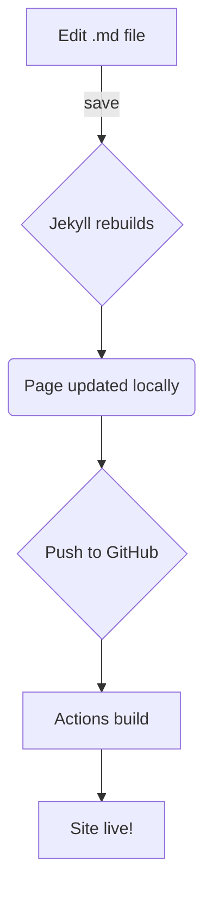
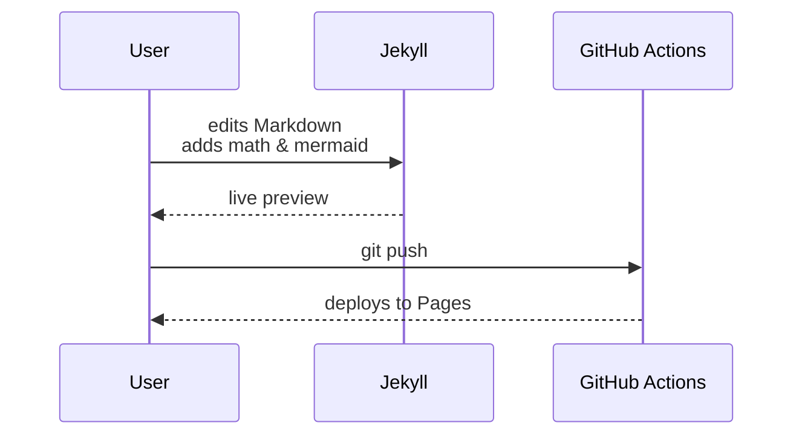

Welcome—this page shows how LaTeX equations and Mermaid charts appear on **negarblog**.

---

## 1  Block equation (display mode)

Euler’s famous identity:

$$
e^{i\pi} + 1 \;=\; 0
$$

---

## 2  Inline math

When \\(x \ne 0\\) the solution to the quadratic  
\\(ax^2 + bx + c = 0\\) is

\\[
x \;=\; \dfrac{-\,b \;\pm\; \sqrt{\,b^{2} - 4ac\,}}{2a}.
\\]

---

## 3  Mermaid flow-chart



---

## 4  Mermaid sequence diagram



---

### Tips

* **MathJax syntax**  
  * Inline: `\\( … \\)` &nbsp;→ \\(a^2+b^2=c^2\\)  
  * Block: `$$ … $$` &nbsp;→ equation on its own line.
* **Mermaid**: wrap the code block in ```mermaid …```.<br>
  Mermaid auto-sizes; add `classes: wide` in front-matter for full-width diagrams.

Happy publishing — feel free to delete this demo post once you’ve confirmed everything renders!
